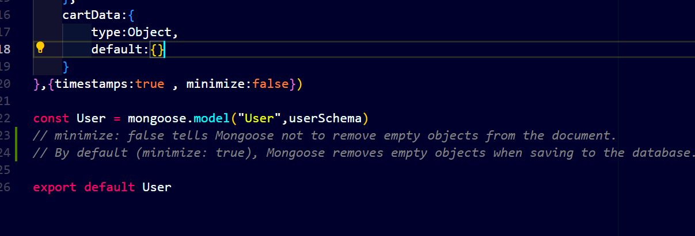
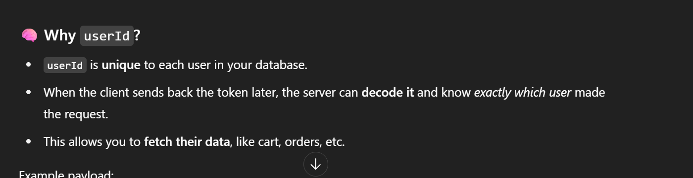
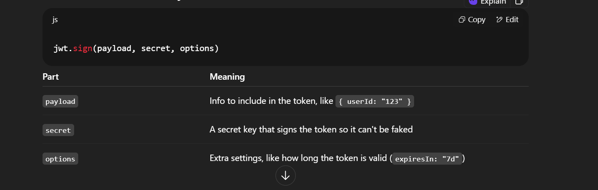
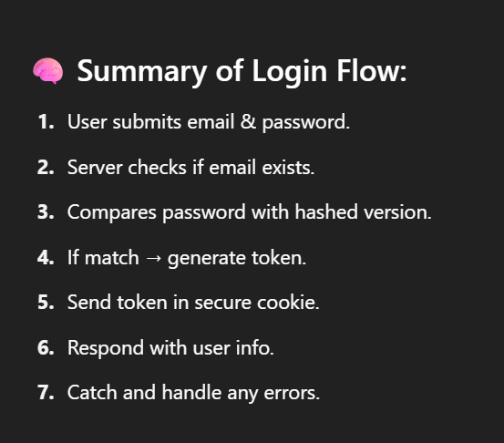
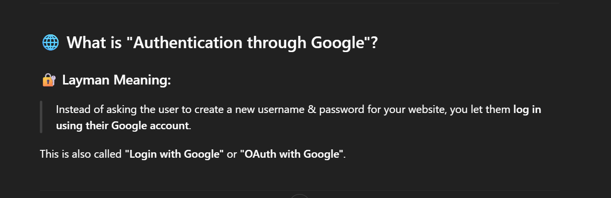
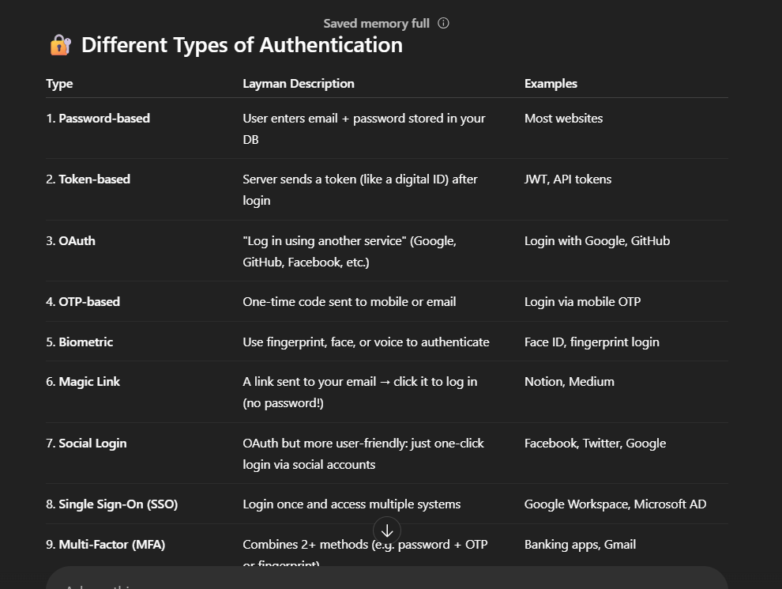
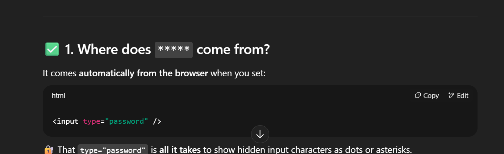
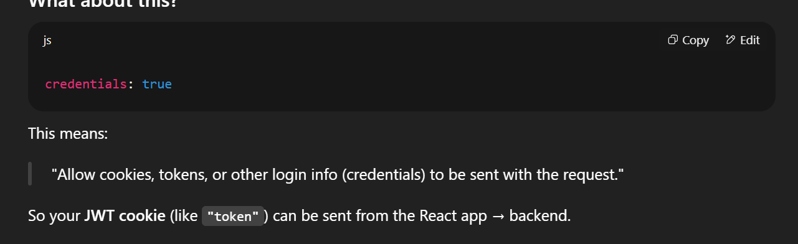
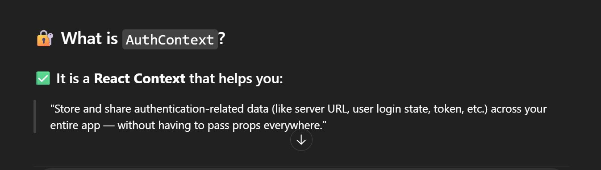

used tailwind here, Google OAuth

we are creating token with token.js and that token gets stored in the cookies

**Cookies are small pieces of data** stored on the client side (usually in the browser) and sent back to the server with every request.

# why userId needed in token.js fxn

## 🍪 What is `res.cookie()`?

In Express.js, `res.cookie()` is a function that lets you **send a cookie** to the browser from the **server response** .

we use axios in frontend so that we can call backend api in our frontend. app.use(cors) ke through we configure in backend-server.js so that CORS error nhi aaye

**React components and context providers must start with a capital letter** .

### 📌 What is `useState`?

`useState` is a **React hook** that lets your component **remember something** (like a variable that React watches).

Imagine your component is a box.

`useState` lets you **store data inside the box** , and if that data changes, React will **automatically re-render** the UI to show the latest data.
